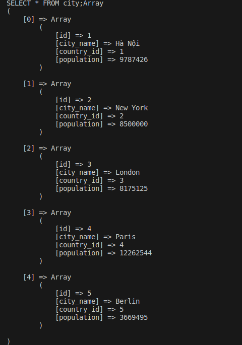

# Builder Design Pattern và cách sử dụng Package PHP

## 1. Builder Design Pattern

Định nghĩa
Builder là một mẫu thiết kế sáng tạo cho phép bạn xây dựng các đối tượng phức tạp theo từng bước. Pattern này cho phép bạn tạo ra các kiểu và biểu diễn khác nhau của một đối tượng bằng cách sử dụng cùng một đoạn code.

Ví dụ: hãy nghĩ về cách tạo đối tượng Ngôi nhà. Để xây dựng một ngôi nhà đơn giản, bạn cần xây dựng bốn bức tường và một tầng, lắp cửa ra vào, lắp một cặp cửa sổ và xây dựng một mái nhà. Nhưng nếu bạn muốn một ngôi nhà lớn hơn, sáng sủa hơn, có sân sau và các tiện ích khác (như hệ thống sưởi, hệ thống ống nước và hệ thống dây điện)?

Giải pháp đơn giản nhất là mở rộng lớp House cơ sở và tạo một tập hợp các lớp con để bao gồm tất cả các tổ hợp của các tham số. Nhưng cuối cùng bạn sẽ có một số lượng đáng kể các lớp con. Bất kỳ thông số mới nào, chẳng hạn như kiểu hiên nhà, sẽ yêu cầu phát triển hệ thống phân cấp này nhiều hơn nữa.

Có một cách tiếp cận khác không liên quan đến việc lai tạo các lớp con. Bạn có thể tạo một phương thức khởi tạo khổng lồ ngay trong lớp House cơ sở với tất cả các tham số có thể có để điều khiển đối tượng house. Mặc dù cách tiếp cận này thực sự loại bỏ sự cần thiết của các lớp con, nhưng nó lại tạo ra một vấn đề khác.

Ví dụ: Giao diện Builder khai báo một tập hợp các phương pháp để lắp ráp một truy vấn MySQL. Tất cả các bước xây dựng đang trả về đối tượng trình tạo hiện tại để cho phép chuỗi: $ builder-> select (...) -> where (...)

    <?php
    namespace Nguyen\DesignPatterns;

    interface SQLQueryBuilder
    {

        public function execinsert(string $table, array $data): SQLQueryBuilder;

        public function execselect(string $table, array $columns): SQLQueryBuilder;

        public function execwhere(string $column, string $value): SQLQueryBuilder;

        public function execorwhere(string $column, string $value, string $operator = '='): SQLQueryBuilder;

        public function execnotwhere(string $column, string $value, string $operator = '='): SQLQueryBuilder;

        public function execorderby(array $data): SQLQueryBuilder;

        public function execfind(string $table, int $id): SQLQueryBuilder;
        
        public function execupdate(string $table, array $data): SQLQueryBuilder;

        public function execdelete(string $table, string $column, string $value): SQLQueryBuilder;

        public function execlimit(int $start, int $offset): SQLQueryBuilder;

        public function execin(string $column, array $data): SQLQueryBuilder;

        public function execjoins(string $table, string $join, string $column1, string $column2): SQLQueryBuilder;

        public function execfirst(): SQLQueryBuilder;

        public function exec_alteradd(string $table, string $column, string $data_type): SQLQueryBuilder;

        public function exec_alterdrop(string $table, string $column): SQLQueryBuilder;

        public function exec_altermodify(string $table, string $column, string $data_type): SQLQueryBuilder;

        public function exec_rename(string $table, string $newname): SQLQueryBuilder;

        public function execgetSQL(): string;

        public function executeQuery(): array;

        public function executeAlterQuery(): bool;

    }

Mỗi Concrete Builder tương ứng với một phương ngữ MySQL cụ thể và có thể triển khai các bước của trình xây dựng hơi khác một chút so với các bước khác.

    <?php
    namespace Nguyen\DesignPatterns;

    class MysqlQueryBuilder implements SQLQueryBuilder
    {
    protected $query;

    protected $table;

    public function __construct()
    {
        $this->query = new \stdClass();
        $this->query->select = "*";
    }

    public function __call(string $name, array $arguments)
    {
        return $this->{"exec" . $name}(...$arguments);

    }

    public static function __callStatic(string $name, array $arguments)
    {
        return (new static)->{"exec" . $name}(...$arguments);
    }

        public function exectable(string $table): self
    {
        $this->query->table = $table;
        $this->query->type = 'select';

        return $this;
    }

        public function execgetSQL(): string
    {
        $query = $this->query;
        $sql = "SELECT " . $this->query->select . " FROM " . $this->query->table;
        if (!empty($query->where)) {
            $sql .= " WHERE " . implode(' AND ', $query->where);
        }
        if (!empty($query->orwhere)) {
            $sql .= " OR " . implode(' OR ', $query->orwhere);
        }
        if (!empty($query->notwhere)) {
            $sql .= " WHERE NOT" . implode(' AND NOT', $query->notwhere);
        }
        if (isset($query->limit)) {
            $sql .= $query->limit;
        }
        if (isset($query->order)) {
            $sql .= $query->order;
        }
        $sql .= ";";

        return $sql;
    }

    public function executeQuery(): array
    {
        $sql = $this->execgetSQL();
        print_r($sql);
        $db = new Database();
        try {
            $qr = $db->connect('localhost', 'root', 'abc1234', 'BT')->query($sql);
        } catch (\PDOException $e) {
            echo "Error executing query: " . $e->getMessage();
            return [];
        }
        $ar = [];
        while ($row = $qr->fetch(\PDO::FETCH_ASSOC)) {
            $ar[] = $row;
        }

        return $ar;
        }
    }

Và đây là khi sử dụng

    <?php
    require './vendor/autoload.php';
    use Nguyen\DesignPatterns\MysqlQueryBuilder;
    use Nguyen\DesignPatterns\Database;

    $result = MysqlQueryBuilder::select(["id", "city_name", "country_id", "population"])->executeQuery();
    print_r($result);

Kết quả

## Cách sử dụng Package PHP 

### Cài đặt

    composer require nguyenzz/design-patterns:dev-main

### Cách sử dụng cơ bản

#### 1. Sử dụng composer autoloader

    require "../vendor/autoload.php";
    use Nguyen\DesignPatterns\Database;
    use Nguyen\DesignPatterns\MysqlQueryBuilder;

#### 2. Thiết lập kết nối CSDL

    $db = Database::connect(string $hostname, string $username, string $password, string $dbname);

#### 3. Sử dụng trình tạo truy vấn
1. Lấy toàn bộ dữ liệu của bảng "city"

        $result =  MysqlQueryBuilder::table("city")->executeSelectQuery();
        print_r($result);

1. Lấy dữ liệu cột "id" và "city_name" của bảng "city"

        $result =  MysqlQueryBuilder::table("city")->select(["id", "city_name"])->executeSelectQuery();
        print_r($result);

1. Tìm số lượng tên thành phố trong bảng "city"

        $result =  MysqlQueryBuilder::table("city")->count("id")->executeSelectQuery();
        print_r($result);

1. Thêm dữ liệu vào bảng "city"

        $result = MysqlQueryBuilder::insert("city", ["6", "nguyen", "2", "453534"])->executeSelectQuery();
        print_r($result);

1. Tìm giá dữ liệu trong bảng "city"

        $result = MysqlQueryBuilder::table("city")->where("city_name", "Hà Nội")->executeSelectQuery();
        print_r($result);
 
1. Sửa dữ liệu của bảng "city"

        $result = MysqlQueryBuilder::update("city", ["id"=>"6", "city_name"=>"nguyen", "country_id" => "2", "population" => "323432"])->executeQuery();
        print_r($result);

1. Giới hạn dữ liệu trả về từ bảng "city"

        $result = MysqlQueryBuilder::table("city")->limit(1, 3)->executeSelectQuery();
        print_r($result);

1. Thêm cột vào bảng "city"

        $result = MysqlQueryBuilder::_alteradd("city", "acreage", "int")->executeAlterQuery();
        print_r($result);

1. Xóa cột ở bảng "city"

        $result = MysqlQueryBuilder::_alterdrop("city", "acreage")->executeAlterQuery();
        print_r($result);

1. Sửa cột ở bảng "city"

        $result = MysqlQueryBuilder::_altermodify("city", "acreage", "int")->executeAlterQuery();
        print_r($result);

1. Kiểm tra sự tồn tại của dữ liệu trong bảng "city"

        $result = MysqlQueryBuilder::exists("city", "country", ["city_name" => "nguyen"])->executeQuery();
        print_r($result);